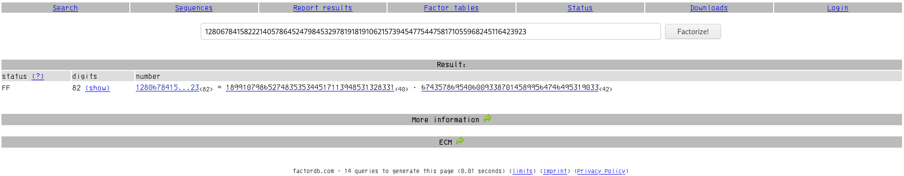
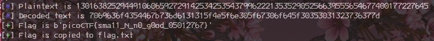

#  Mind your Ps and Qs

## 0x1 : Introduction

>Description
>In RSA, a small e value can be problematic, but what about N? Can you decrypt this? values

La description est très clair, nous allons devoir attaquer N afin de le factoriser et trouver les valeurs p et q.

Le titre etait dailleur très explicite.

## 0x2 : Analyse

On récupère les informations données dans le fichier Value:

>Decrypt my super sick RSA:
>
>c: 62324783949134119159408816513334912534343517300880137691662780895409992760262021
>
>n: 1280678415822214057864524798453297819181910621573945477544758171055968245116423923
>
>e: 65537

Nous avons le message chiffré (**c**) le modulus (**n**) et pour finir la clef publique (**e**)

Pour déchiffrer le message, nous allons avoir besoin de la clef privée **d**, qui est calculable via $\phi$n

## 0x3 : Factorisation

Un petit passage chez [FactorDB](http://factordb.com/index.php?query=1280678415822214057864524798453297819181910621573945477544758171055968245116423923)

Qui nous donnes les informations suivantes:



## 0x4 : déchiffrement du message

À partir de là, nous pouvons donc trouver $\phi$n selon le calcul suivant:

$\phi$n = (p-1) * (q-1)

puis calculer **d** :

d = e<sup>-1</sup>mod($\phi$n)

Ou avec ChatonCTF avec l'option **rsaFindDfromPQ**:

```python
chatonCTF.rsaFindDfromPhi(p,q,e)
```

et finalement utiliser la clef privée pour déchiffrer le message:

m = c<sup>d</sup>mod(n)

## 0x5 : Passage du message déchiffré en lisible

Bon, le message trouvé n'est pas très lisible comme cela, il faut l'avouer,
mais nous pouvons le rendre lisible avec pwntools et unhex.

Pour cela il faut d'abord transformer la réponse reçu en hexadécimale:

```python3 
hexstr = hex(m)[2:]
```

puis:

```python3
flag = pwn.unhex(hexstr)
```

Ce qui donne le résultat suivant:

>picoCTF{sma11_N_n0_g0od_05012767}

## 0x6 : Outro

Pas très compliqué comme défi quand l'on a les bases sur lec challenges RSA,
mais c'était une occasion parfaite pour tester le module [chatonCTF](https://github.com/tiphergane/chatonCTF).


